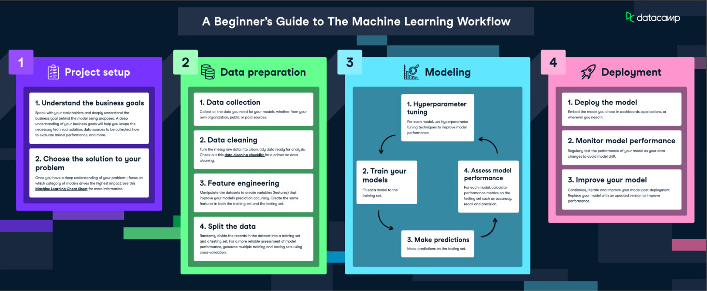
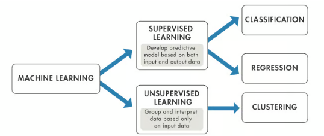

## What is ML?

A subset of artificial intelligence (AI) that focuses on the development of computer algorithms that improve automatically through experience and by the use of data. In simpler terms, machine learning enables computers to learn from data and make decisions or predictions without being explicitly programmed to do so.

## How is it different from traditional AI?

In traditional programming, a computer follows a set of predefined instructions to perform a task. However, in machine learning, the computer is given a set of examples (data) and a task to perform, but it's up to the computer to figure out how to accomplish the task based on the examples it's given.

## Example:

we want a computer to recognize images of cats, we don't provide it with specific instructions on what a cat looks like. Instead, we give it thousands of images of cats and let the machine learning algorithm figure out the common patterns and features that define a cat. 

## Machine learning vs AI vs deep learning

---

### **1. Artificial Intelligence (AI) — The Big Umbrella**

**Definition:**
AI is the broad field of computer science that focuses on making machines **“think and act like humans.”**
It includes everything from rule-based systems to learning-based models.

**Goal:**
To simulate **human intelligence** — reasoning, learning, perception, decision-making, and problem-solving.

**Examples:**

* Chatbots that answer customer questions.
* Google Maps suggesting the best route.
* Self-driving cars making decisions.

**Think of AI as:**
*“Making computers smart.”*

---

### **2. Machine Learning (ML) — A Subset of AI**

**Definition:**
ML is a part of AI that allows systems to **learn from data** without being explicitly programmed.

Instead of hardcoding rules, you give data to algorithms, and they **learn patterns** and **make predictions**.

**Goal:**
To enable machines to **learn from experience (data)** and improve automatically.

**Examples:**

* Spam filters learning from email patterns.
* Netflix recommending movies based on your history.
* Credit card fraud detection systems.

**Think of ML as:**
*“Learning from data to make predictions.”*

---

### **3. Deep Learning (DL) — A Subset of ML**

**Definition:**
Deep Learning is a type of ML that uses **neural networks** (inspired by the human brain) with many layers (“deep” networks).

It’s especially powerful for **complex, unstructured data** like images, text, and audio.

**Goal:**
To learn **high-level representations** of data automatically using neural networks.

**Examples:**

* Face recognition on your phone.
* Voice assistants like Siri or Alexa understanding speech.
* ChatGPT (it’s a deep learning model, specifically a “transformer”).

**Think of DL as:**
*“Learning complex things using many layers of artificial neurons.”*

---

### **Summary Table**

| Concept           | Part of | Key Idea                                  | Example                    |
| ----------------- | ------- | ----------------------------------------- | -------------------------- |
| **AI**            | —       | Simulating human intelligence             | Self-driving cars          |
| **ML**            | AI      | Learning from data                        | Netflix recommendations    |
| **Deep Learning** | ML      | Neural networks learning complex patterns | Face or speech recognition |

---

### Analogy:

Think of it like this:

* **AI** = The entire field → “We want to make machines intelligent.”
* **ML** = A method in AI → “We’ll teach machines through data.”
* **DL** = A special method in ML → “We’ll use neural networks to learn complex stuff.”

---

## How Does Machine Learning Work?

## Types of Machine Learning

### 1- Supervised Machine Learning

In this approach, the model is trained on a labeled dataset. That to make further predictions.
### - Linear Regression:
If the output column in the dataset is "Numerical"
### - Linear Classification:
If the output is "Discrete" (eg: 0/1, T/F, Yes/No)

### 2- Unsupervised Learning

It involves training the model on an unlabeled dataset. The model is left to find patterns and relationships in the data on its own.

This type of learning is often used for clustering and dimensionality reduction. Clustering involves grouping similar data points together, while dimensionality reduction involves reducing the number of random variables under consideration by obtaining a set of principal variables.
